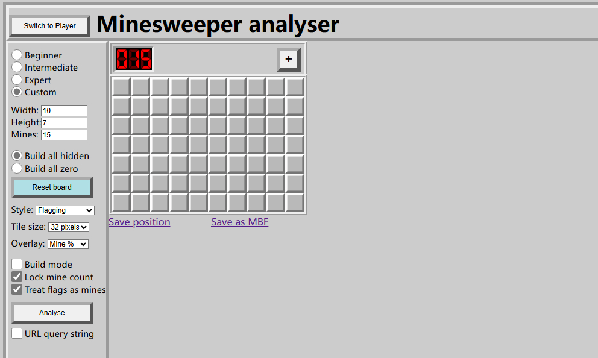
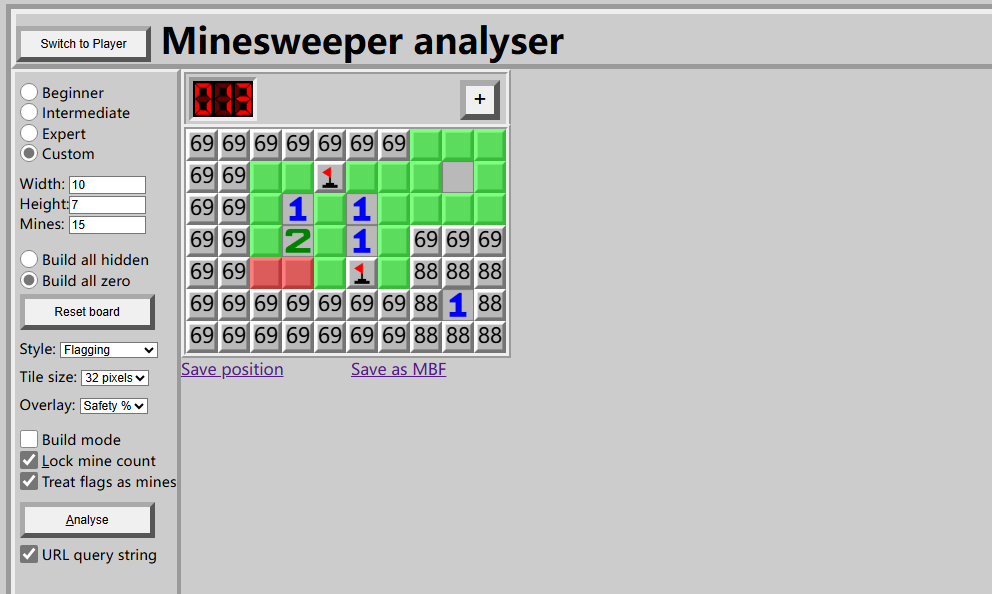

# DDT_10×7×15_MinesweeperAnalyser (DDTMA)

## 什么？你说下面的你全看不懂？
- ① 首先，点开这里 → https://whitelilydev.github.io/JSMinesweeper_D/DDT.html

- ② 然后，把扫雷调到你要分析的情景，鼠标滚轮设定雷数，左键设定是否已揭开，右键设定是不是确定的雷。

- ③ 然后点击Analys就是分析，如果Analys灰了说明情况错了，红色是雷 绿色是安全 数字是是有雷的概率。

- ④ 重复②③，成功过关后重新点击①或者点击左边的[Reset board]。

## How to use the DDTMA

To access the analyser press the button in the top left corner. 

To start you are presented with a blank expert board which is all *zeros*. You can start with all *hidden* by selecting *build all hidden* and then reseting the board.

From here you can construct the position you wish to analyse. This is best done in the following order:
1. Use the left mouse button (or 'h') to toggle a tile from hidden to revealed.
2. Drag the mouse with the left mouse button down to toggle each tile the mouse passes over
3. Use the right mouse button (or 'f') to place and remove flags.  A flag is considered to be a mine by the solver, whether it is *knowable* from the position or not.
4. Placing and removing a flag will automatically adjust the values of revealed tiles adjacent to it.
5. Use the mousewheel to adjust the value of a revealed tile.  Alternatively, use the 0-8 keys. The value is constrained to be a legal value based on the adjacent tiles.
6. Use the mousewheel to adjust the mine count showing how many mines left to find.  The value can be adjusted by 10s or 1s depending on which digit the mouse is over

If the board is valid the **Analyse** button will be enabled and pressing this (or the 'a' key) will start the analyser. 

**New:**
**Positions can be saved and stored on a local disc. They can be reloaded by dropping them onto the board grid.**

The safe tiles are shown in green and the mines in red. If no certain move is available then the solver will highlight the move it considers best in yellow with a green centre.  Other moves it considered but rejected are shown in yellow. Tiles highlighted in grey can have only one possible value and it is never correct to play these when there are other moves available.

If you are playing a game and using the analyser to provide assistance then you can keep the mine count in step by selecting "Lock mine count".  Now every time a flag is placed the mine counter is reduced by one.

## How the solver determines the best play

The solver has a number of techniques it uses to solve the board:
- Trivial analysis
- Probability engine
- 50/50 and pseudo-50/50 detection
- Guessing logic
- Brute force analysis

## Trivial Analysis

This is used to quickly find any moves which are trivially discovered:
- A satisfied tile has it's remaining adjacent tiles cleared
- A tile with space only for the remaining mines has the mines identified. Depending on the play style they may not be flagged.

If plays are discovered then processing ends at this stage.  Further analysis might find other options, but equally they might be found trivially in the next iteration of the solver.

## Thanks

Thanks to https://github.com/DavidNHill/Minesweeper
